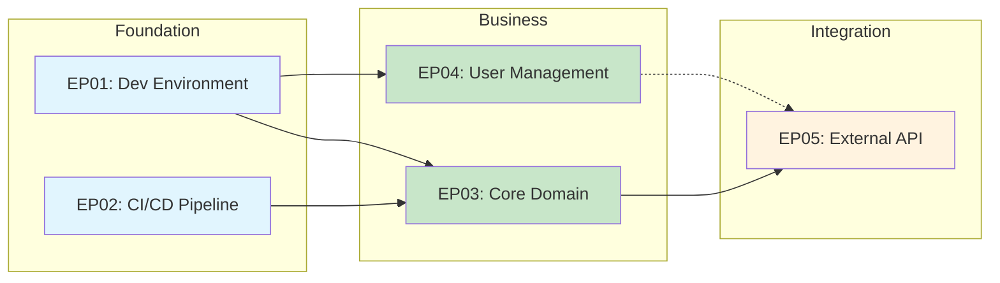

# Dependency Patterns

Guidance on managing epic dependencies effectively.

## Dependency Types

| Type | Definition | Planning Impact |
|------|------------|-----------------|
| **Hard** | Cannot start without completion | Strictly sequential |
| **Soft** | Preferred but workaround exists | Can parallel with interface contract |
| **None** | Fully independent | Full parallelisation possible |

## Healthy Patterns

### Layered Foundation

```
Foundation ──────────────────────────────────────────►
     │
     ├──► Business Epic A ──┐
     │                      ├──► Integration Epic
     └──► Business Epic B ──┘
```

**Why it works:** Foundation unblocks parallel business work.

### Vertical Slices

```
Slice A        Slice B        Slice C
(F→B→I)   ──►  (F→B→I)   ──►  (F→B→I)
```

**Why it works:** Each slice delivers end-to-end value independently.

### Diamond with Contracts

```
Foundation ──► Business A ──┐
           └─► Business B ──┼──► Integration
                            │   (interface contract)
```

**Why it works:** Integration can start once contract is defined, not when business epics complete.

### Enabler Track

```
Foundation ──► Business Epics ──────────────────────►
     │
     └──► Enabler Epic (observability) ─────────────►
              [runs parallel, integrates incrementally]
```

**Why it works:** Enablers don't block business delivery but enhance it.

## Problematic Patterns

### Circular Dependencies

```
❌ Epic A ──► Epic B ──► Epic C ──► Epic A
```

**Problem:** No valid starting point.

**Solution:** Extract shared component to new Foundation epic.

### Deep Sequential Chain

```
❌ A ──► B ──► C ──► D ──► E ──► F ──► G
```

**Problem:** Single failure blocks everything; no parallelisation.

**Solutions:**
- Identify parallel tracks within the chain
- Apply vertical slicing
- Define intermediate integration points

### Everything Depends on Everything

```
❌ A ◄──► B ◄──► C
   │      │      │
   ▼      ▼      ▼
   D ◄──► E ◄──► F
```

**Problem:** Tightly coupled; changes cascade.

**Solutions:**
- Extract foundation layer
- Define explicit interface contracts
- Identify bounded contexts

### Hidden Foundation

```
❌ Business A ──► Business B
        │              │
        └──────────────┴──► [Shared component buried in A]
```

**Problem:** Business A becomes a stealth foundation epic.

**Solution:** Extract shared component to explicit Foundation epic.

## Soft Dependency Strategies

When you have a soft dependency, use these strategies:

### Interface Contract First

```
Epic A (defines contract) ──► Epic B (implements contract)
              │
              └──► Epic C (uses contract with mock)
```

Epic C can proceed using mock/stub while B implements.

### Feature Flags

```
Epic A (core feature)
     │
     └──► Epic B (enhancement, behind flag)
```

B can be developed in parallel, activated when ready.

### Strangler Pattern (for migrations)

```
Legacy System ◄─── Facade ───► New Epic
                     │
              [gradual traffic shift]
```

New epic development parallels legacy operation.

## Dependency Matrix Template

Create this matrix in `docs/planning/epic-catalogue.md`:

```markdown
## Dependency Matrix

|          | EP01 | EP02 | EP03 | EP04 | EP05 |
|----------|------|------|------|------|------|
| **EP01** | —    |      |      |      |      |
| **EP02** | H    | —    |      |      |      |
| **EP03** | H    | S    | —    |      |      |
| **EP04** |      |      |      | —    |      |
| **EP05** |      | H    | H    |      | —    |

H = Hard dependency (row depends on column)
S = Soft dependency (row prefers column complete)
```

## Mermaid Graph Template



Use solid lines for hard dependencies, dashed for soft.